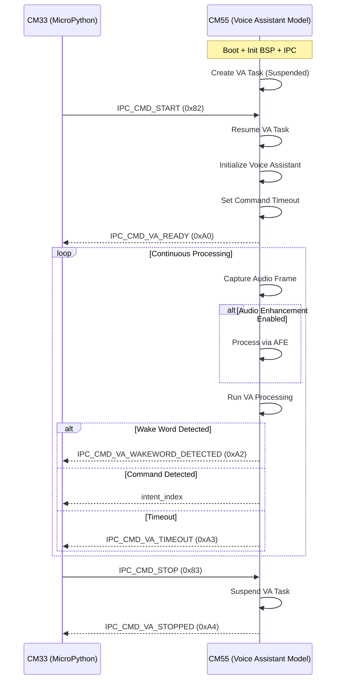
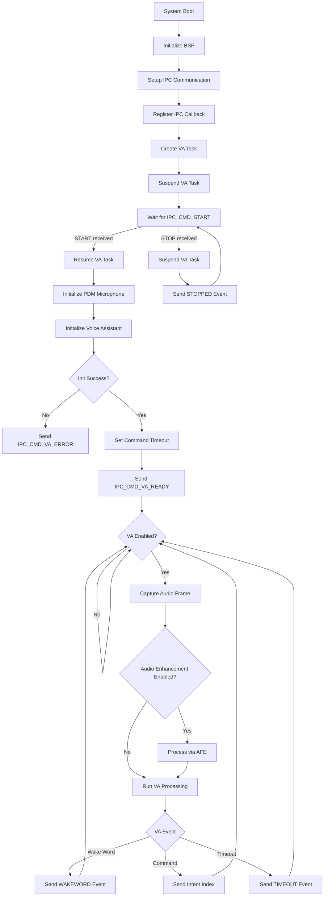
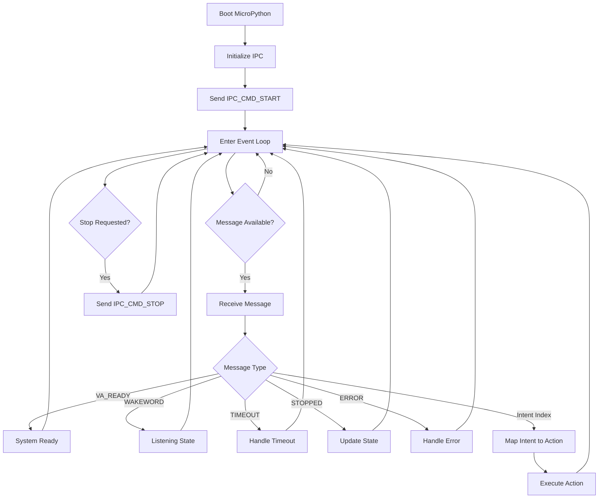

# PSOC&trade; Edge MCU: DEEPCRAFT&trade; Voice Assistant deployment using MicroPython with Dual - Core Implementation

This code example demonstrates how to use PSOC&trade; Edge MCU to deploy DEEPCRAFT&trade; Voice Assistant (VA) models detecting wake words and spoken commands using natural language on CM55 while MicroPython running on CM33 core acts as the application host.

This code example utilizes only CM55 core and is programmed to the external QSPI flash in Execute in Place (XIP) mode. It is mandatory to have MicroPython firmware flashed on CM33 to use this example code.

> [!NOTE]
> 1. The Audio and Voice middleware included in this example has a limited operation of about 15 and 30 minutes. For the unlimited license, contact Infineon support.
> 2. This code example supports only the Arm&reg; and LLVM compilers, which need to be installed separately. See the *Software Setup* section below.

[View this README on GitHub.](https://github.com/Infineon/mtb-example-psoc-edge-voice-assistant-deploy-mpy)

## Requirements

- [ModusToolbox&trade;](https://www.infineon.com/modustoolbox) v3.7 or later (tested with v3.7)
- Board support package (BSP) minimum required version: 1.0.0
- Programming language: C
- Associated parts: All [PSOC&trade; Edge MCU](https://www.infineon.com/products/microcontroller/32-bit-psoc-arm-cortex/32-bit-psoc-edge-arm) parts

## Supported toolchains (make variable 'TOOLCHAIN')

- Arm&reg; Compiler v6.22 (`ARM`)
- LLVM Embedded Toolchain for Arm&reg; v19.1.5 (`LLVM_ARM`) - Default value of `TOOLCHAIN`

## Supported Kits (make variable 'TARGET')

- [PSOC&trade; Edge E84 AI Kit](https://www.infineon.com/KIT_PSE84_AI) (`KIT_PSE84_AI`)

## Software Setup

See the [ModusToolbox&trade; tools package installation guide](https://www.infineon.com/ModusToolboxInstallguide) for information about installing and configuring the tools package.

Install a terminal emulator if you do not have one. Instructions in this document use [Tera Term](https://teratermproject.github.io/index-en.html).

Install [Arm&reg; Compiler for Embedded](https://developer.arm.com/Tools%20and%20Software/Arm%20Compiler%20for%20Embedded) toolchain. Note that an Arm&reg; account and license is required for this compiler. Alternatively, install [LLVM compiler](https://github.com/ARM-software/LLVM-embedded-toolchain-for-Arm/releases/tag/release-19.1.5), which does not require a license.

Depending on your choice of compiler (Arm, LLVM), set these env variables or set in common_app.mk with the path.
- Arm Compiler for Embedded  
CY_COMPILER_ARM_DIR=[path to Arm compiler installation]  
For example: C:/Program Files/ArmCompilerforEmbedded6.22

- LLVM compiler  
CY_COMPILER_LLVM_ARM_DIR=[path to LLVM compiler location]  
For example: C:/llvm/LLVM-ET-Arm-19.1.5-Windows-x86_64

If you like to customize the wake word and the spoken commands, you need to have access to the [DEEPCRAFT&trade; Voice-Assistant Cloud tool](https://deepcraft.infineon.com/solutions/voice-assistant) and create your own wake word and spoken commands.

## Operation

See [Using the code example](docs/using_the_code_example.md) for instructions on creating a project, opening it in various supported IDEs, and performing tasks, such as building, programming, and debugging the application within the respective IDEs.

1. Connect the board to your PC using the provided USB cable through the KitProg3 USB connector

2. Program the CM55 core by clicking on the project and then flashing. This ensures only CM55 core is flashed.

3. Open a MicroPython supported IDE - like Thonny and connect to the same port where board is connected. Run the provided MicroPython application code.

4. Speak the wake word "OK test" followed by command shown in the terminal.

5. Confirm that the command is printed correctly in the terminal

6. To customize the wake word and commands, use the [DEEPCRAFT&trade; Voice-Assistant Cloud tool](https://deepcraft.infineon.com/solutions/voice-assistant) to generate new code to be used in the application. Copy the generated files to the *proj_cm55/va_models* folder and update `DEEPCRAFT_PROJECT_NAME` in the *common.mk* file to the project name used in the cloud tool. Re-program the board and test the new wake word and commands

7. The code example comes with the `GPIO_control_Demo` DEEPCRAFT&trade; project example, which controls the kit's pin P17_1 and prints the list of commands supported on the terminal. Set `DEEPCRAFT_PROJECT_NAME` to `GPIO_control_Demo` in the *common.mk* file to use this project, build and program it. Follow the instructions printed in the terminal.

Detailed explanation is available in the following section.

## Code Explanation
The two cores communicate exclusively through the on-chip IPC (Inter-Processor Communication) pipe. CM55 handles all audio acquisition, preprocessing, wake-word detection, and command recognition — CM33 handles all application logic, LED control, display output, network connectivity, or any other task you choose to implement in MicroPython.

### Sequence Diagram

### IPC Communication Protocol Commands

Following commands are sent from CM33 to control the Voice Assistant lifecycle:

| Command | Value | Description |
|--------|------|-------------|
| `IPC_CMD_START` | `0x82` | Starts the Voice Assistant task on CM55 |
| `IPC_CMD_STOP`  | `0x83` | Stops (suspends) the Voice Assistant task |

Following commands are sent from CM55 to notify CM33 about system state and detection results.

| Command | Value | Description |
|--------|------|-------------|
| `IPC_CMD_VA_READY` | `0xA0` | Voice Assistant initialized and ready |
| `IPC_CMD_VA_WAKEWORD_DETECTED` | `0xA2` | Wake word detected |
| `IPC_CMD_VA_TIMEOUT` | `0xA3` | Command listening timed out |
| `IPC_CMD_VA_STOPPED` | `0xA4` | Voice Assistant stopped (acknowledgement) |
| `IPC_CMD_VA_ERROR` | `0xE1` | Fatal error occurred |

### CM55 Code Flow

### CM33 Code Flow

### MicroPython Application Code

The MicroPython application code to be run on the CM33 core is located at [scripts/va_app.py](scripts/va_app.py). To install MicroPython, follow the steps mentioned [here](https://ifx-micropython-psoc-edge.readthedocs.io/en/latest/psoc-edge/installation.html).

## Related Resources

Resources  | Links
-----------|----------------------------------
Application notes  | [AN235935](https://www.infineon.com/AN235935) – Getting started with PSOC&trade; Edge E84 MCU on ModusToolbox&trade; software   [AN240916](https://www.infineon.com/AN240916) - DEEPCRAFT&trade; Audio Enhancement on PSOC&trade; Edge E84 MCU 
Code examples  | [Using ModusToolbox&trade;](https://github.com/Infineon/Code-Examples-for-ModusToolbox-Software) on GitHub
Device documentation | [PSOC&trade; Edge MCU datasheets](https://www.infineon.com/products/microcontroller/32-bit-psoc-arm-cortex/32-bit-psoc-edge-arm#documents)   [PSOC&trade; Edge MCU reference manuals](https://www.infineon.com/products/microcontroller/32-bit-psoc-arm-cortex/32-bit-psoc-edge-arm#documents)
Development kits | Select your kits from the [Evaluation board finder](https://www.infineon.com/cms/en/design-support/finder-selection-tools/product-finder/evaluation-board)
Libraries  | [mtb-dsl-pse8xxgp](https://github.com/Infineon/mtb-dsl-pse8xxgp) – Device support library for PSE8XXGP   [retarget-io](https://github.com/Infineon/retarget-io) – Utility library to retarget STDIO messages to a UART port
Tools  | [ModusToolbox&trade;](https://www.infineon.com/modustoolbox) – ModusToolbox&trade; software is a collection of easy-to-use libraries and tools enabling rapid development with Infineon MCUs for applications ranging from wireless and cloud-connected systems, edge AI/ML, embedded sense and control, to wired USB connectivity using PSOC&trade; Industrial/IoT MCUs, AIROC&trade; Wi-Fi and Bluetooth&reg; connectivity devices, XMC&trade; Industrial MCUs, and EZ-USB&trade;/EZ-PD&trade; wired connectivity controllers. ModusToolbox&trade; incorporates a comprehensive set of BSPs, HAL, libraries, configuration tools, and provides support for industry-standard IDEs to fast-track your embedded application development