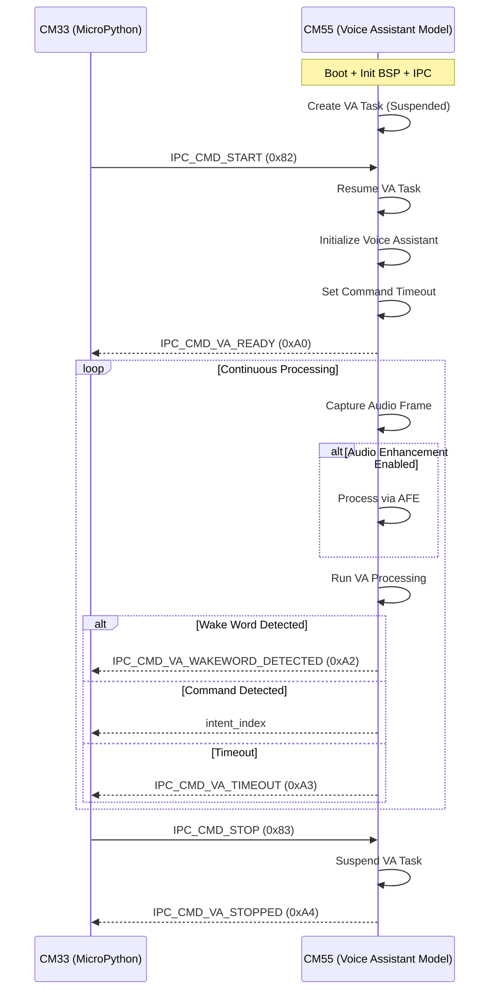
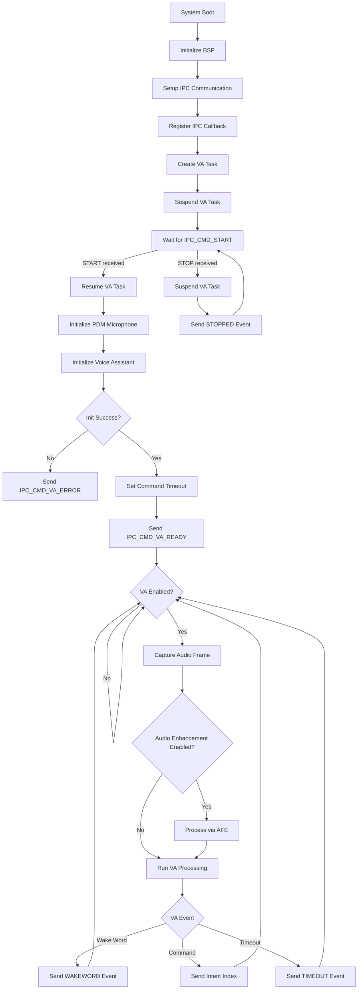
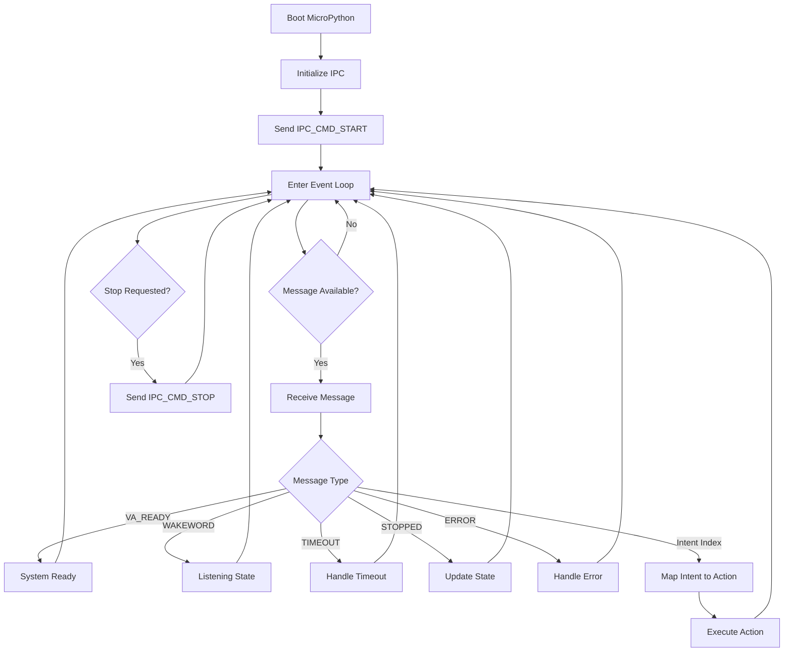

# PSOC&trade; Edge MCU: DEEPCRAFT&trade; Voice Assistant deployment using MicroPython with Dual - Core Implementation

This code example demonstrates how to use PSOC&trade; Edge MCU to deploy DEEPCRAFT&trade; Voice Assistant (VA) models detecting wake words and spoken commands using natural language on CM55 while MicroPython running on CM33 core acts as the application host.

This code example utilizes only CM55 core and is programmed to the external QSPI flash in Execute in Place (XIP) mode. It is mandatory to have MicroPython firmware flashed on CM33 to use this example code.

> **Note:**
> 1. The Audio and Voice middleware included in this example has a limited operation of about 15 and 30 minutes. For the unlimited license, contact Infineon support
> 2. This code example supports only the Arm&reg; and LLVM compilers, which need to be installed separately. See the *Software Setup* section below

[View this README on GitHub.](https://github.com/Infineon/mtb-example-psoc-edge-voice-assistant-deploy)

[Provide feedback on this code example.](https://yourvoice.infineon.com/jfe/form/SV_1NTns53sK2yiljn?Q_EED=eyJVbmlxdWUgRG9jIElkIjoiQ0UyNDE0MTAiLCJTcGVjIE51bWJlciI6IjAwMi00MTQxMCIsIkRvYyBUaXRsZSI6IlBTT0MmdHJhZGU7IEVkZ2UgTUNVOiBERUVQQ1JBRlQmdHJhZGU7IFZvaWNlIEFzc2lzdGFudCBkZXBsb3ltZW50IiwicmlkIjoicm9kb2xmby5sb3NzaW9AaW5maW5lb24uY29tIiwiRG9jIHZlcnNpb24iOiIxLjIuMCIsIkRvYyBMYW5ndWFnZSI6IkVuZ2xpc2giLCJEb2MgRGl2aXNpb24iOiJNQ0QiLCJEb2MgQlUiOiJJQ1ciLCJEb2MgRmFtaWx5IjoiUFNPQyJ9)

## Requirements
- [ModusToolbox&trade;](https://www.infineon.com/modustoolbox) v3.7 or later (tested with v3.7)
- Board support package (BSP) minimum required version: 1.0.0
- Programming language: C
- Associated parts: All [PSOC&trade; Edge MCU](https://www.infineon.com/products/microcontroller/32-bit-psoc-arm-cortex/32-bit-psoc-edge-arm) parts


## Supported toolchains (make variable 'TOOLCHAIN')

- Arm&reg; Compiler v6.22 (`ARM`)
- LLVM Embedded Toolchain for Arm&reg; v19.1.5 (`LLVM_ARM`) - Default value of `TOOLCHAIN`


## Supported kits (make variable 'TARGET')

- [PSOC&trade; Edge E84 AI Kit](https://www.infineon.com/KIT_PSE84_AI) (`KIT_PSE84_AI`)

## Software setup

See the [ModusToolbox&trade; tools package installation guide](https://www.infineon.com/ModusToolboxInstallguide) for information about installing and configuring the tools package.

Install a terminal emulator if you do not have one. Instructions in this document use [Tera Term](https://teratermproject.github.io/index-en.html).

Install [Arm&reg; Compiler for Embedded](https://developer.arm.com/Tools%20and%20Software/Arm%20Compiler%20for%20Embedded) toolchain. Note that an Arm&reg; account and license is required for this compiler. Alternatively, install [LLVM compiler](https://github.com/ARM-software/LLVM-embedded-toolchain-for-Arm/releases/tag/release-19.1.5), which does not require a license.

Depending on your choice of compiler (Arm, LLVM), set these env variables or set in common_app.mk with the path.
- Arm Compiler for Embedded <br>
CY_COMPILER_ARM_DIR=[path to Arm compiler installation] <br>
For example: C:/Program Files/ArmCompilerforEmbedded6.22

- LLVM compiler <br>
CY_COMPILER_LLVM_ARM_DIR=[path to LLVM compiler location] <br>
For example: C:/llvm/LLVM-ET-Arm-19.1.5-Windows-x86_64

If you like to customize the wake word and the spoken commands, you need to have access to the [DEEPCRAFT&trade; Voice-Assistant Cloud tool](https://deepcraft.infineon.com/solutions/voice-assistant) and create your own wake word and spoken commands.

## Operation

See [Using the code example](docs/using_the_code_example.md) for instructions on creating a project, opening it in various supported IDEs, and performing tasks, such as building, programming, and debugging the application within the respective IDEs.

1. Connect the board to your PC using the provided USB cable through the KitProg3 USB connector

2. Program the CM55 core by clicking on the project and then flashing. This ensures only CM55 core is flashed.

3. Open a MicroPython supported IDE - like Thonny and connect to the same port where board is connected. Run the provided MicroPython application code.

4. Speak the wake word "OK test" followed by command shown in the terminal.

5. Confirm that the command is printed correctly in the terminal

6. To customize the wake word and commands, use the [DEEPCRAFT&trade; Voice-Assistant Cloud tool](https://deepcraft.infineon.com/solutions/voice-assistant) to generate new code to be used in the application. Copy the generated files to the *proj_cm55/va_models* folder and update `DEEPCRAFT_PROJECT_NAME` in the *common.mk* file to the project name used in the cloud tool. Re-program the board and test the new wake word and commands

7. The code example comes with the `GPIO_control_Demo` DEEPCRAFT&trade; project example, which controls the kit's pin P17_1 and prints the list of commands supported on the terminal. Set `DEEPCRAFT_PROJECT_NAME` to `GPIO_control_Demo` in the *common.mk* file to use this project, build and program it. Follow the instructions printed in the terminal.

Detailed explanation is available in the following section.


## Code Explanation
The two cores communicate exclusively through the on-chip IPC (Inter-Processor Communication) pipe. CM55 handles all audio acquisition, preprocessing, wake-word detection, and command recognition — CM33 handles all application logic, LED control, display output, network connectivity, or any other task you choose to implement in MicroPython.

### Sequence Diagram


### IPC Communication Protocol Commands

Following commands are sent from CM33 to control the Voice Assistant lifecycle:

| Command | Value | Description |
|--------|------|-------------|
| `IPC_CMD_START` | `0x82` | Starts the Voice Assistant task on CM55 |
| `IPC_CMD_STOP`  | `0x83` | Stops (suspends) the Voice Assistant task |

Followings commands are sent from CM55 to notify CM33 about system state and detection results.

| Command | Value | Description |
|--------|------|-------------|
| `IPC_CMD_VA_READY` | `0xA0` | Voice Assistant initialized and ready |
| `IPC_CMD_VA_WAKEWORD_DETECTED` | `0xA2` | Wake word detected |
| `IPC_CMD_VA_TIMEOUT` | `0xA3` | Command listening timed out |
| `IPC_CMD_VA_STOPPED` | `0xA4` | Voice Assistant stopped (acknowledgement) |
| `IPC_CMD_VA_ERROR` | `0xE1` | Fatal error occurred |

### CM55 Code Flow



### CM33 Code Flow



### MicroPython Application code

Below is the application code to be run on CM33 core post installation of MicroPython. To install MicroPython, follow the steps mentioned [here](https://ifx-micropython-psoc-edge.readthedocs.io/en/latest/psoc-edge/installation.html).

```python
from machine import IPC, Pin
import time

# --- Pin setup ---
pin_p17_1 = Pin("P17_1", Pin.OUT, value=1)

IPC_CMD_VA_READY             = 0xA0
IPC_CMD_VA_WAKEWORD_DETECTED = 0xA2
IPC_CMD_VA_TIMEOUT           = 0xA3
IPC_CMD_VA_STOPPED           = 0xA4
IPC_CMD_VA_ERROR             = 0xE1

# --- Model intent index mapping (update to match your DEEPCRAFT model) ---
# intent_index 0 -> "Make P17_1 high"
# intent_index 1 -> "Make P17_1 low"
INTENT_ACTIONS = {
    0: lambda: (pin_p17_1.value(0), print("P17_1 -> LOW")),
    1: lambda: (pin_p17_1.value(1), print("P17_1 -> HIGH")),
}

# --- IPC setup ---
ipc = IPC(src_core=IPC.CM33, target_core=IPC.CM55)
ipc.init()

va_svc = {"received": False, "cmd": None}

def va_svc_cb(cmd, val, cid):
    va_svc["received"] = True
    va_svc["cmd"] = cmd

r1 = ipc.register_client(3, va_svc_cb, 1, 1)
print("Voice Assistant Model service registered:", r1)

ipc.enable_core(IPC.CM55)
time.sleep_ms(500)

ipc.send(IPC.CMD_START, 0, 5)
print('\nSay the wake-word "OK test" followed by a command: \n1) Make P17_1 high \n2) Make P17_1 low\n')

# --- Cycle tracking ---
pin_low_done  = False
pin_high_done = False

# --- Main receive loop ---
while True:
    if va_svc["received"]:
        cmd = va_svc["cmd"]
        va_svc["received"] = False
        va_svc["cmd"] = None

        if cmd == IPC_CMD_VA_READY:
            print("CM55: VA ready and listening")

        elif cmd == IPC_CMD_VA_WAKEWORD_DETECTED:
            print("CM55: Wake-word detected!")

        elif cmd == IPC_CMD_VA_TIMEOUT:
            print("CM55: Command timeout - say wake-word again")

        elif cmd == IPC_CMD_VA_STOPPED:
            print("CM55: VA stopped - exiting")
            break

        elif cmd == IPC_CMD_VA_ERROR:
            print("CM55: Fatal VA error - exiting")
            break

        elif cmd in INTENT_ACTIONS:
            INTENT_ACTIONS[cmd]()
            # Track cycle completion
            if cmd == 0: pin_low_done  = True
            if cmd == 1: pin_high_done = True

        else:
            print("CM55: unknown cmd=0x{:02X}".format(cmd))

        # Stop after one complete cycle
        if pin_low_done and pin_high_done:
            print("\nCycle complete - sending STOP to CM55")
            ipc.send(IPC.CMD_STOP, 0, 5)
            timeout = 1000
            while timeout > 0 and not va_svc["received"]:
                time.sleep_ms(10)
                timeout -= 10
            break

    time.sleep_ms(10)

# Cleanup
pin_p17_1.value(1)
time.sleep_ms(20)
print("\nVA Assistant model execution stopped")

```

## Related resources

Resources  | Links
-----------|----------------------------------
Application notes  | [AN235935](https://www.infineon.com/AN235935) – Getting started with PSOC&trade; Edge E84 MCU on ModusToolbox&trade; software <br> [AN240916](https://www.infineon.com/AN240916) - DEEPCRAFT&trade; Audio Enhancement on PSOC&trade; Edge E84 MCU 
Code examples  | [Using ModusToolbox&trade;](https://github.com/Infineon/Code-Examples-for-ModusToolbox-Software) on GitHub
Device documentation | [PSOC&trade; Edge MCU datasheets](https://www.infineon.com/products/microcontroller/32-bit-psoc-arm-cortex/32-bit-psoc-edge-arm#documents) <br> [PSOC&trade; Edge MCU reference manuals](https://www.infineon.com/products/microcontroller/32-bit-psoc-arm-cortex/32-bit-psoc-edge-arm#documents)
Development kits | Select your kits from the [Evaluation board finder](https://www.infineon.com/cms/en/design-support/finder-selection-tools/product-finder/evaluation-board)
Libraries  | [mtb-dsl-pse8xxgp](https://github.com/Infineon/mtb-dsl-pse8xxgp) – Device support library for PSE8XXGP <br> [retarget-io](https://github.com/Infineon/retarget-io) – Utility library to retarget STDIO messages to a UART port
Tools  | [ModusToolbox&trade;](https://www.infineon.com/modustoolbox) – ModusToolbox&trade; software is a collection of easy-to-use libraries and tools enabling rapid development with Infineon MCUs for applications ranging from wireless and cloud-connected systems, edge AI/ML, embedded sense and control, to wired USB connectivity using PSOC&trade; Industrial/IoT MCUs, AIROC&trade; Wi-Fi and Bluetooth&reg; connectivity devices, XMC&trade; Industrial MCUs, and EZ-USB&trade;/EZ-PD&trade; wired connectivity controllers. ModusToolbox&trade; incorporates a comprehensive set of BSPs, HAL, libraries, configuration tools, and provides support for industry-standard IDEs to fast-track your embedded application development

<br>


## Other resources

Infineon provides a wealth of data at [www.infineon.com](https://www.infineon.com) to help you select the right device, and quickly and effectively integrate it into your design.


## Document history

Document title: *CE241410* – *PSOC&trade; Edge MCU: DEEPCRAFT&trade; Voice Assistant deployment*

 Version | Description of change
 ------- | ---------------------
 1.0.0   | New code example
 1.1.0   | Updated voice-assistant middleware to v2.x <br> Added an option to set the command timeout
 1.2.0   | Updated design files to fix ModusToolbox&trade; v3.7 build warnings
 
<br>


All referenced product or service names and trademarks are the property of their respective owners.

The Bluetooth&reg; word mark and logos are registered trademarks owned by Bluetooth SIG, Inc., and any use of such marks by Infineon is under license.

PSOC&trade;, formerly known as PSoC&trade;, is a trademark of Infineon Technologies. Any references to PSoC&trade; in this document or others shall be deemed to refer to PSOC&trade;.

---------------------------------------------------------

© Cypress Semiconductor Corporation, 2023-2025. This document is the property of Cypress Semiconductor Corporation, an Infineon Technologies company, and its affiliates ("Cypress").  This document, including any software or firmware included or referenced in this document ("Software"), is owned by Cypress under the intellectual property laws and treaties of the United States and other countries worldwide.  Cypress reserves all rights under such laws and treaties and does not, except as specifically stated in this paragraph, grant any license under its patents, copyrights, trademarks, or other intellectual property rights.  If the Software is not accompanied by a license agreement and you do not otherwise have a written agreement with Cypress governing the use of the Software, then Cypress hereby grants you a personal, non-exclusive, nontransferable license (without the right to sublicense) (1) under its copyright rights in the Software (a) for Software provided in source code form, to modify and reproduce the Software solely for use with Cypress hardware products, only internally within your organization, and (b) to distribute the Software in binary code form externally to end users (either directly or indirectly through resellers and distributors), solely for use on Cypress hardware product units, and (2) under those claims of Cypress's patents that are infringed by the Software (as provided by Cypress, unmodified) to make, use, distribute, and import the Software solely for use with Cypress hardware products.  Any other use, reproduction, modification, translation, or compilation of the Software is prohibited.
<br>
TO THE EXTENT PERMITTED BY APPLICABLE LAW, CYPRESS MAKES NO WARRANTY OF ANY KIND, EXPRESS OR IMPLIED, WITH REGARD TO THIS DOCUMENT OR ANY SOFTWARE OR ACCOMPANYING HARDWARE, INCLUDING, BUT NOT LIMITED TO, THE IMPLIED WARRANTIES OF MERCHANTABILITY AND FITNESS FOR A PARTICULAR PURPOSE.  No computing device can be absolutely secure.  Therefore, despite security measures implemented in Cypress hardware or software products, Cypress shall have no liability arising out of any security breach, such as unauthorized access to or use of a Cypress product. CYPRESS DOES NOT REPRESENT, WARRANT, OR GUARANTEE THAT CYPRESS PRODUCTS, OR SYSTEMS CREATED USING CYPRESS PRODUCTS, WILL BE FREE FROM CORRUPTION, ATTACK, VIRUSES, INTERFERENCE, HACKING, DATA LOSS OR THEFT, OR OTHER SECURITY INTRUSION (collectively, "Security Breach").  Cypress disclaims any liability relating to any Security Breach, and you shall and hereby do release Cypress from any claim, damage, or other liability arising from any Security Breach.  In addition, the products described in these materials may contain design defects or errors known as errata which may cause the product to deviate from published specifications. To the extent permitted by applicable law, Cypress reserves the right to make changes to this document without further notice. Cypress does not assume any liability arising out of the application or use of any product or circuit described in this document. Any information provided in this document, including any sample design information or programming code, is provided only for reference purposes.  It is the responsibility of the user of this document to properly design, program, and test the functionality and safety of any application made of this information and any resulting product.  "High-Risk Device" means any device or system whose failure could cause personal injury, death, or property damage.  Examples of High-Risk Devices are weapons, nuclear installations, surgical implants, and other medical devices.  "Critical Component" means any component of a High-Risk Device whose failure to perform can be reasonably expected to cause, directly or indirectly, the failure of the High-Risk Device, or to affect its safety or effectiveness.  Cypress is not liable, in whole or in part, and you shall and hereby do release Cypress from any claim, damage, or other liability arising from any use of a Cypress product as a Critical Component in a High-Risk Device. You shall indemnify and hold Cypress, including its affiliates, and its directors, officers, employees, agents, distributors, and assigns harmless from and against all claims, costs, damages, and expenses, arising out of any claim, including claims for product liability, personal injury or death, or property damage arising from any use of a Cypress product as a Critical Component in a High-Risk Device. Cypress products are not intended or authorized for use as a Critical Component in any High-Risk Device except to the limited extent that (i) Cypress's published data sheet for the product explicitly states Cypress has qualified the product for use in a specific High-Risk Device, or (ii) Cypress has given you advance written authorization to use the product as a Critical Component in the specific High-Risk Device and you have signed a separate indemnification agreement.
<br>
Cypress, the Cypress logo, and combinations thereof, ModusToolbox, PSoC, CAPSENSE, EZ-USB, F-RAM, and TRAVEO are trademarks or registered trademarks of Cypress or a subsidiary of Cypress in the United States or in other countries. For a more complete list of Cypress trademarks, visit www.infineon.com. Other names and brands may be claimed as property of their respective owners.