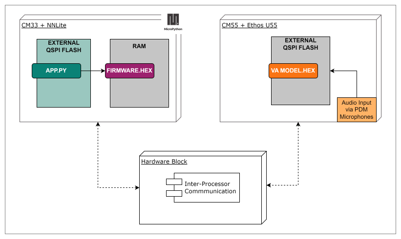
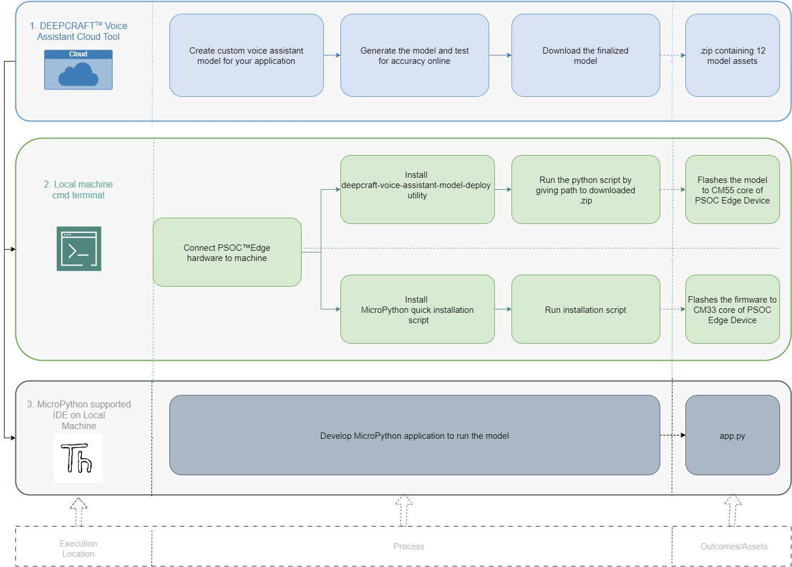

1. CM33 running MicroPython over IPC
=====================================

This enablement uses the CM33 core running MicroPython as the application host,
communicating with the CM55 inference engine over the on-chip IPC pipe.

MicroPython firmware runs in CM33 RAM, executing the application logic and user
interaction as a Python script. The CM55 core runs the user-generated Voice Assistant
model. CM33 orchestrates execution by triggering and communicating with CM55 through
the on-chip Inter-Processor Communication (IPC) block.

.. contents::
   :local:
   :depth: 1

----

Requirements
--------------

**CM55** — see :ref:`requirements`.

**CM33**

- `MicroPython for PSOC™ Edge <https://ifx-micropython-psoc-edge.readthedocs.io/en/latest/psoc-edge/installation.html>`_ flashed to the board
- A MicroPython IDE, e.g. `Thonny <https://thonny.org/>`_

----

Quickstart
------------

The typical user journey looks like below:

Follow the steps below to deploy your first DEEPCRAFT™ Voice Assistant model to the board.

**1 - Model Generation** 

Design and export a wake-word and command model from the
`DEEPCRAFT™ Voice Assistant cloud tool <https://deepcraft.infineon.com/solutions/voice-assistant>`_. This step is not needed if you are using the pre-built ``test_gpio_control`` model
shipped in the repository for a quick test.

.. warning::
    While extracting the model from the .zip, kindly refrain from renaming any files or folders.

**2 - Deploy model to the board**

Use the deployment tool to install the model assets, compile the CM55 firmware, and flash it to the board in one shot.

**Download the tool:**

.. code-block:: console

   curl -s -L -o deepcraft-voice-assistant-model-deploy.py https://raw.githubusercontent.com/Infineon/mtb-example-psoc-edge-voice-assistant-deploy-mpy/main/tools/deepcraft-voice-assistant-model-deploy.py

**Run the deploy command:**

.. code-block:: powershell

   python deepcraft-voice-assistant-model-deploy.py all test_gpio_control

Replace ``test_gpio_control`` with the path to your own model folder or ``.zip``
exported.

**3 - Flash MicroPython firmware**

Follow the `MicroPython for PSOC™ Edge installation guide
<https://ifx-micropython-psoc-edge.readthedocs.io/en/latest/psoc-edge/installation.html>`_ to flash the CM33 core with the MicroPython firmware.

**4 - Run the MicroPython application**

Open MicroPython supported IDE (e.g. Thonny), and copy the below MicroPython code to run on the CM33 core.

.. code-block:: python

   from machine import IPC, Pin
   from deepcraft_model import DeepcraftModel
   import time

   # ---------------------------------------------------------------------------
   # Hardware output — update to match your board/model
   # ---------------------------------------------------------------------------
   pin_out = Pin("P17_1", Pin.OUT, value=1)

   # Intent index → action mapping.
   # Update these to match the commands defined in your DEEPCRAFT model.
   INTENT_ACTIONS = {
       0: lambda: (pin_out.value(0), print("[HOST] P17_1 -> LOW")),
       1: lambda: (pin_out.value(1), print("[HOST] P17_1 -> HIGH")),
   }

   # ---------------------------------------------------------------------------
   # Transport setup — IPC
   # DeepcraftModel constructor calls ipc.init() automatically.
   # ---------------------------------------------------------------------------
   ipc = IPC(src_core=IPC.CM33, target_core=IPC.CM55)

   # ---------------------------------------------------------------------------
   # DeepcraftModel — wraps the transport and exposes VA events
   # ---------------------------------------------------------------------------
   model = DeepcraftModel(ipc)

   # ---------------------------------------------------------------------------
   # Event callback — invoked by the wrapper with (va_model_events_t, value)
   # ---------------------------------------------------------------------------
   def on_va_event(event, value):
       if event == DeepcraftModel.VA_EVENT_READY:
           print("[HOST] VA ready and listening")

       elif event == DeepcraftModel.VA_EVENT_WAKEWORD_DETECTED:
           print("[HOST] Wake-word detected!")

       elif event == DeepcraftModel.VA_EVENT_INTENT:
           intent_idx = value
           print("[HOST] Intent received: index =", intent_idx)
           action = INTENT_ACTIONS.get(intent_idx)
           if action:
               action()
           else:
               print("[HOST] Unknown intent index:", intent_idx)

       elif event == DeepcraftModel.VA_EVENT_TIMEOUT:
           print("[HOST] Command timeout — say the wake-word again")

       elif event == DeepcraftModel.VA_EVENT_STOPPED:
           print("[HOST] VA stopped")

       elif event == DeepcraftModel.VA_EVENT_ERROR:
           print("[HOST] Fatal VA error")

       else:
           print("[HOST] Unknown event:", event, "value:", value)

   model.set_event_cb(on_va_event)

   # ---------------------------------------------------------------------------
   # Boot the target and start the VA
   # ---------------------------------------------------------------------------
   model.enable_target()  # powers on / boots the target processor
   time.sleep_ms(500)     # allow target boot time

   model.start()          # sends DEEPCRAFT_CMD_START to the target
   print('\n[HOST] Say the wake-word "OK test" followed by a command:')
   print("       0) Make P17_1 LOW")
   print("       1) Make P17_1 HIGH\n")

   # ---------------------------------------------------------------------------
   # Main event loop
   # ---------------------------------------------------------------------------
   while True:
       if model.state() == DeepcraftModel.STATE_IDLE:
           break
       time.sleep_ms(10)

   # Cleanup
   pin_out.value(1)
   time.sleep_ms(20)
   print("\nVA Assistant model execution stopped")

.. note::
   This example is specific to the ``test_gpio_control`` model. When using your own
   model, update ``INTENT_ACTIONS`` and the printed wake-word and command labels to
   match what your DEEPCRAFT™ project defines.

----

Related repositories
----------------------

.. list-table::
   :header-rows: 1
   :widths: 50 50

   * - Repository
     - Purpose
   * - `mtb-example-psoc-edge-voice-assistant-deploy-mpy
       <https://github.com/Infineon/mtb-example-psoc-edge-voice-assistant-deploy-mpy>`_
     - CM55 firmware and deployment tool
   * - `micropython-deepcraft-model-interface
       <https://github.com/Infineon/micropython-deepcraft-model-interface>`_
     - MicroPython C extension — ``DeepcraftModel`` and DEEPCRAFT engine
   * - `MicroPython for PSOC™ Edge
       <https://github.com/Infineon/micropython-psoc-edge>`_
     - MicroPython port for PSOC™ Edge E84 (CM33)
